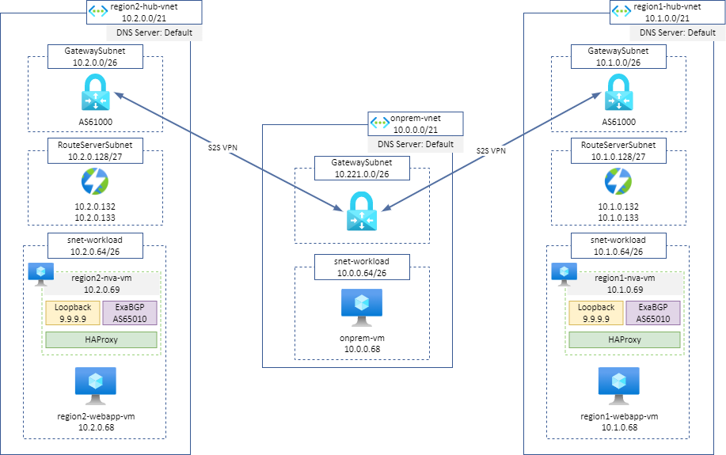
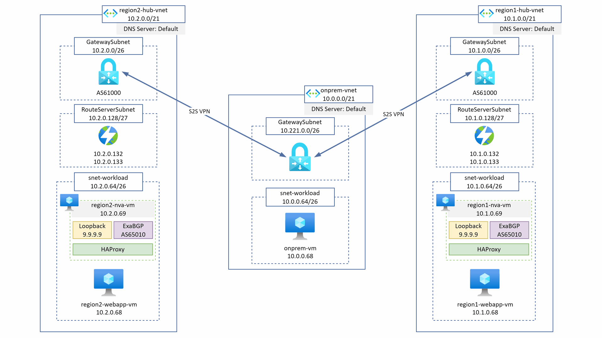

# LAB - Azure Route Server - Anycast multi-region load balancing

This lab is the terraform implementation of [Azure Route Server - Anycast multi-region load balancing](https://github.com/adstuart/azure-routeserver-anycast) from [Adam Stuart](https://github.com/adstuart).

## Architecture

## Route Propagation

## Quick start

* Clone the GitHub repository
  
`git clone https://github.com/dawlysd/lab-azure-routeserver-anycast`

* Go to the new folder "lab-azure-routeserver-anycast/templates" and initialize the terraform modules 
  
`cd lab-azure-routeserver-anycast/templates`

`terraform init`

* Now run apply to start the deployment
  
`terraform apply`